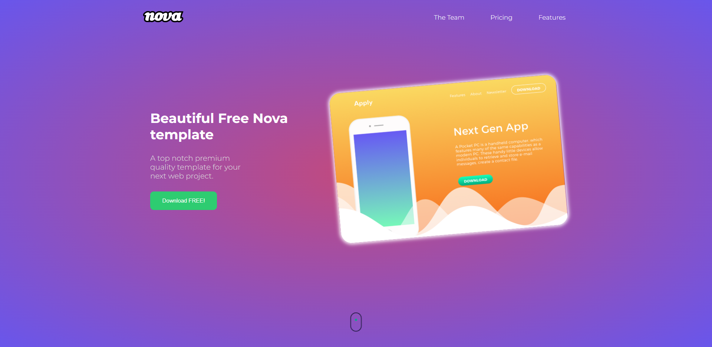
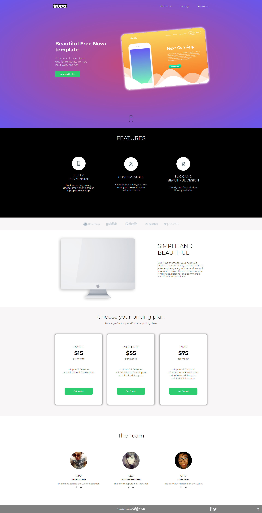

# Website Project

I prepared the website according to the project.

I followed the design from [Webscope](https://themewagon.com/themes/project-app-showasing-onepage-bootstrap-template-free-nova/).

See the live version of my [website](https://kubi33.github.io/task-html-and-css-basics/).

## :bulb: Technologies
 

## :camera: Screenshots

## :thought_balloon: Conclusions for future projects

I would like to improve responsive to my web design.

## :clap: Thanks
- To [Webscope](https://themewagon.com/themes/project-app-showasing-onepage-bootstrap-template-free-nova/) for free templates.
- To my [mentor](https://github.com/devmentor-pl) for creating the task and for the code review.