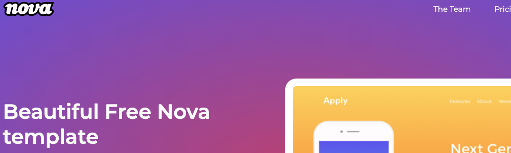

# Responsive website task

Chceck live version of this project: **[LIVE](https://rafalkazik.github.io/task-html-and-css-basics/)**

## :technologist: Technologies and metodologies

HTML & CSS & BEM & Mobile first

## :mailbox: Feel free to contact me

You can find me on **[LINKEDIN](https://www.linkedin.com/in/rafa%C5%82-kazik-924b8710a/)**

## Thanks :handshake:

Thanks to my [Mentor - devmentor.pl](https://www.devmentor.pl) - for providing me with this task and for code review.
