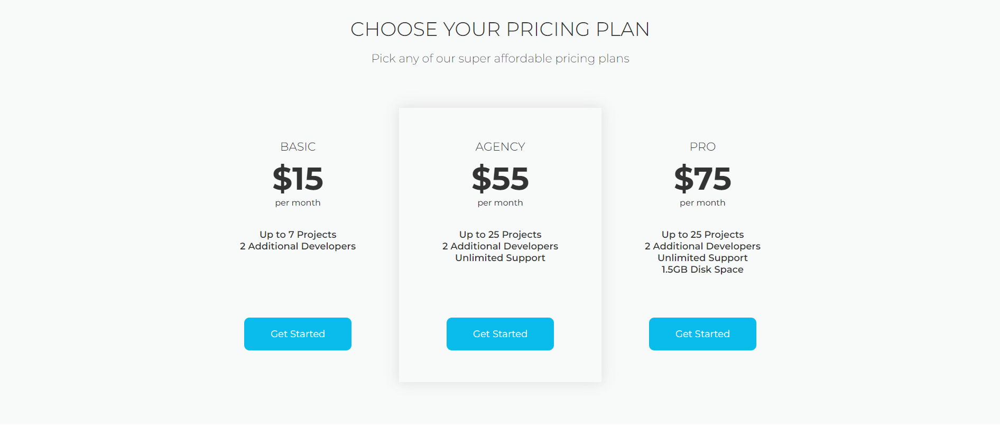

# Nova landing page - html/css
The landing page is a recreation of [Webscope's](https://themewagon.com/author/webscopeapp/) free template: [Nova](https://themewagon.com/themes/project-app-showasing-onepage-bootstrap-template-free-nova/)

This is **the first** website project created through [devmentor.pl](https://devmentor.pl/mentoring-javascript) mentoring program. It's written in **html** and **css**. 

Works only on **Desktop**.
## Problems and Solutions
### Topics:
1) Get used to [BEM](https://getbem.com/) methodology (I've just learned the idea).
2) Use appropriate [BEM](https://getbem.com/) class naming.
3) Properly implement [Montserrat](https://fonts.google.com/specimen/Montserrat) font.

### 1) Problem: "Class naming mess":
When there's only one page, class naming is easy, but when more pages with similar but different elements appear the question is: How to name them as **neutral** as possible? **The first** attempt wasn't neutral at all. It looked like this:
```
<div class="wrapper wrapper-first">
<div class="wrapper wrapper-second">
<div class="wrapper wrapper-third">
```
So **the problem was**: what if I'd like to change the order of the pages in the future? If I left it like that it would be a nightmare to edit all those names later!

### > Solution
**Second attempt** took me a while because I noticed that the naming convention is horrible after finishing 4th page.
So, after the edit my class names was looking much better:
```
<div  class="wrapper wrapper--main-page">
<div  class="wrapper wrapper--features">
<aside  class="wrapper wrapper--logos">
/* and so on... */
```
I've assigned class names to **specific sections**. f.e:

`<div  class="wrapper wrapper--features">` was wrapper for this section:


`<ul  class="section__item section__item--plan">` was section__item for inside payment plan page:


### 2) Problem: "border-radius hides my picture maliciously"
I got some images to use on page **"features"**. I had to create white circle background around it.
The first result was actually really annoying:


### > Solution
After trying some things, I've decided to create a container around the image and it solved the problem:


```
<div  class="section__img section__img--features">
	
</div>
```
### 3) Problem: "Padding of father or margin of children?"
At the beginning I was positioning elements within the parent sometimes using **parent's padding**, another time using **children's margin**. By doing this I was lacking consistency so a **view in devtools** was messy.

### > Solution
I've decided to position element within **parent** using it's **padding**, then position **children** relative to each other with thier **margin**.

### 4) Problem: "Why font @face-type needs to be SO LONG?"
In this project I needed to use [Montserrat](https://fonts.google.com/specimen/Montserrat) font. I went to [Google fonts](https://fonts.google.com/) and downloaded it. Inside my downloaded folder I noticed two files with **variable fonts**. I didn't know before that something like this exist. So I've done my research and decided to use it because of how useful and convenient they are.

* They require less http requests.
* I can just write 2x @face-type (one for regular and for italic) to implement whole font-family.
* I have more options for adjusting size (from 1 to 999) of the font (I don't need it in this project tho).

**The problem** was that although variable fonts are widely supported (IE, Opera mini excluded) **font-variation-settings** [property isn't](https://caniuse.com/?search=font-variation-settings) (as of 23.11.2023). Futhermore, my IT friends told me that **font-weight** and **font-style** are **desirable properties** because **font-variation-settings** according to a [documentation](https://webreference.com/css/properties/font-variation-settings/) overrides them.

### > Conclusion
Since I used a **variable font** a lot in this project, I decided to **leave it as is**. If I were creating this site commercially, **I would change** this font to a standard one.
