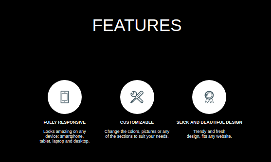
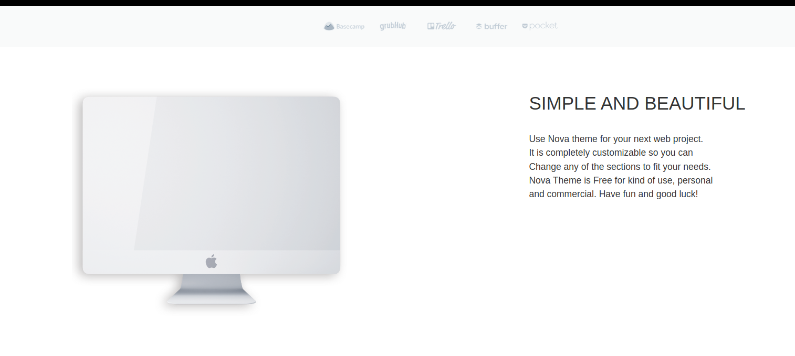
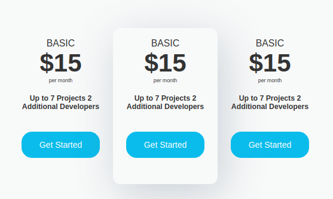

# Nova - first page


The first page, modeled on the whitescope nova teamplate project.
Which is part of the mentoring program - devmentor.pl
Written in HTML and CSS

 ### 1) The use of classes in the BEM methodology
```
<div  class="main__container block">
<article  class="main__container--article">
<h1  class="article__title bold">
" Beautiful Free Nova template "
<br  />
</h1>
<h2  class="article__text light">
A top notch premium quality template for your next web project.
<br/>
</h2>
```

### 2 ) Placing graphics on a round background
Making a round background and placing graphics on a transparent background inside it. It seems like a simple task, but at the beginning of the journey of learning code it was not so.
Of course, after trials and changes, the task was done:


### 3 ) Graphics that go beyond the container
With a percentage division of two containers, when the window was enlarged, the graphics were unruly and the "monitor" went beyond the size of its container. It was necessary to put a frame on it and determine its maximum dimensions. Which resulted in good looks.


### 4 ) Payment table
Making the table with payments was quite easy, it took me a while to find a way to make its middle one have a very nice shadow effect underneath it, made in CSS. What is the effect of specifying a given price:

 

