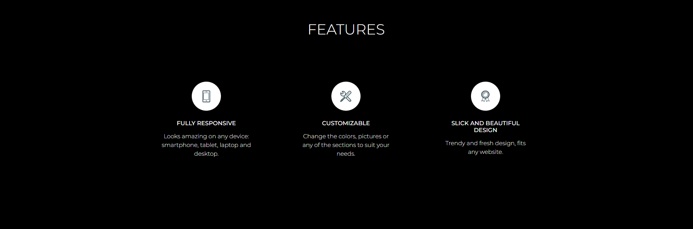
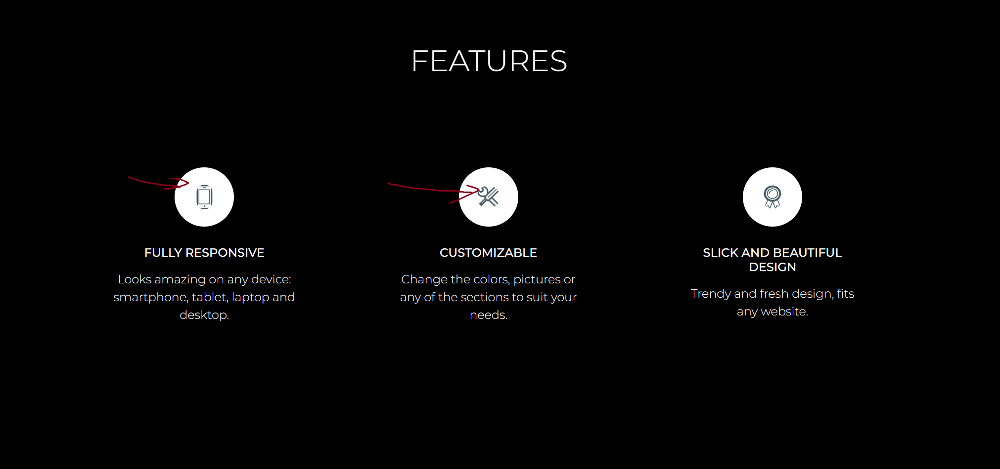
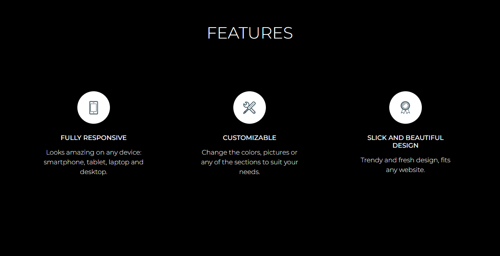

# Nova landing page - html/css
The landing page is a recreation of [Webscope's](https://themewagon.com/author/webscopeapp/) free template: [Nova](https://themewagon.com/themes/project-app-showasing-onepage-bootstrap-template-free-nova/)

This is **the first** website project and the conclusion of **2nd chapter** (there's **20**) of [devmentor.pl](https://devmentor.pl/mentoring-javascript) mentoring program. It's written in **html** and **css**. 

Works only on **Desktop**.

---

## Content:
[1) Versatile BEM naming.](#1-versatile-bem-naming)
[2) Border-radius hides pictures.](#2-border-radius-hides-pictures)
[3) Padding of the parent or margin of the children?](#3-padding-of-the-parent-or-margin-of-the-children)
[4) Variable fonts](#4-variable-fonts)

---

### 1) Versatile BEM naming
When a website consists of only one page, class naming is straightforward. However, when additional pages with similar but distinct elements are introduced, the question arises: How can these elements be named in a way that is **as descriptive as possible**?

Let's loot at the example:
```
<div class="wrapper wrapper-first">
<div class="wrapper wrapper-second">
<div class="wrapper wrapper-third">
```
This was my first attempt to name different sections of the website. The problem with this approach arises when considering potential changes to the page order, as it would necessitate renaming the pages to maintain logical consistency. It's just too much work, especially with many classes named this way.

### > Solution
The attempt to change it happened later because I noticed that the naming convention was horrible after completing the fourth page.

After the edit my class names was more versatile:
```
<div  class="wrapper wrapper--main-page">
<div  class="wrapper wrapper--features">
<aside  class="wrapper wrapper--logos">
/* and so on... */
```
I've assigned class names to **specific sections**. f.e:

`<div  class="wrapper wrapper--features">` was wrapper for this section:


`<ul class="section__container section__container--plan">` was container for these three plan cards:


---

### 2) Border-radius hides pictures
I got use some images on page **"features"**. I had to create white circle background around it because they were transparent.
The first result was actually really annoying:


### > Solution

The cause of this effect was that the `border-radius` was applied directly to these images. Adding a container around these images with `border-radius` on it solved the issue:



---

### 3) Padding of the parent or margin of the children?
At the beginning I was positioning elements within the parent using **parent's padding**, another time using **children's margin**. By doing this, I lacked consistency, resulting in a messy appearance in **devtools**.

### > Solution
I've decided to position elements within **parent** using it's **padding**. If i need to position **children** relative to each other, I'll use **margin**.

### 4) Variable fonts
In this project I needed to use [Montserrat](https://fonts.google.com/specimen/Montserrat) font. I went to [Google fonts](https://fonts.google.com/) and downloaded it. Inside my downloaded folder I noticed two files with **variable fonts**. I didn't know before that something like this exist. So I've done my research and decided to use it because of how useful and convenient they are.

* They require less http requests.
* I can just write 2x @face-type (one for regular and for italic) to implement whole font-family.
* I have more options for adjusting size (from 1 to 999) of the font (I don't need it in this project tho).

Although variable fonts are widely supported (IE, Opera mini excluded) **font-variation-settings** (variable-font's property) [property isn't](https://caniuse.com/?search=font-variation-settings) (as of 23.11.2023). Futhermore, my IT friends told me that **font-weight** and **font-style** (standard font's properties) are **desirable properties** because **font-variation-settings** according to a [documentation](https://webreference.com/css/properties/font-variation-settings/) overrides them.

### > Conclusion
Since I was using **variable font** a lot in this project, I've decided to **leave it as is**. If I were creating this site commercially, **I would change** the font to a standard one.
