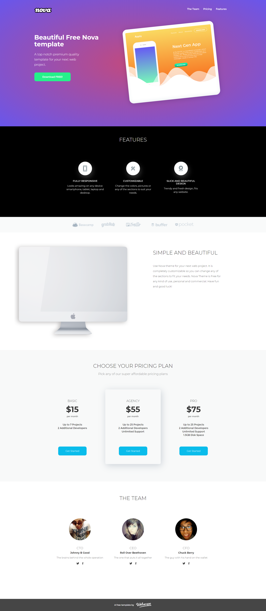
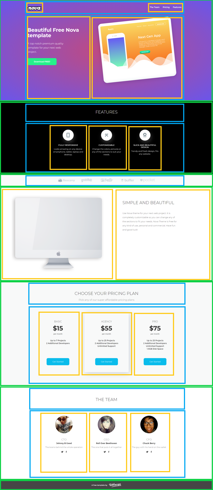

In order to start app install npm packages by npm install command, then open app by command npm run start.

> ⭐ ***README** to coś więcej niż opis. Poprzez nie **pokazujesz swoje mocne strony** – swoją dokładność, sposób myślenia i podejście do rozwiązywania problemów. Niech Twoje README pokaże, że masz **świetne predyspozycje do rozwoju!***
> 
> 🎁 *Zacznij od razu. Skorzystaj z **[szablonu README i wskazówek](https://github.com/devmentor-pl/readme-template)**.* 

&nbsp;

# HTML & CSS: Podstawy

Najwyższy czas zakodować prawdziwą stronę internetową! 

Będziemy się wzorować na projekcie od [Webscope](https://themewagon.com/themes/project-app-showasing-onepage-bootstrap-template-free-nova/), który wygląda tak:

&nbsp;

## Opis projektu

Wszystkie niezbędne grafiki masz przygotowane w katalogu `images`. Znajdziesz tam m.in. [pliki SVG](https://pl.wikipedia.org/wiki/Scalable_Vector_Graphics). W VS Code ich podgląd uzyskasz dzięki rozszerzeniu [SVG](https://marketplace.visualstudio.com/items?itemName=jock.svg).

Font, który jest używany w projekcie, to [Montserrat](https://fonts.google.com/specimen/Montserrat).

Tło w górnej części strony to gradient: 
`background: radial-gradient(rgb(194, 74, 126), rgb(105, 86, 235));`

Jeśli chcesz dokładnie odwzorować położenie poszczególnych elementów, możesz użyć rozszerzenia do Chrome o nazwie [PerfectPixel](https://chrome.google.com/webstore/detail/perfectpixel-by-welldonec/dkaagdgjmgdmbnecmcefdhjekcoceebi). Pozwoli Ci ono osadzić przedstawiony wyżej plik poglądowy (lokalizacja: `./assets/demo.png`) jako tło dla tworzonej strony.

> **Uwaga!** Możliwe, że w powyższym rozszerzeniu będziesz musiał użyć odpowiedniej skali obrazu wykorzystywanego jako podgląd. Jest to zależne od [ustawień systemowych](https://pliki.wiki/blog/jak-korzystac-ze-skalowania-ekranu-w-systemie-windows-10/). Zazwyczaj jednak domyślne ustwienia wtyczki dobrze się sprawdzają i poza jej instalacją nie musisz nic robić.

Strona nie musi być wykonana zgodnie z pierwowzorem 1:1. Ważne, aby na pierwszy rzut oka było widać, że jest to ten sam projekt. 

Pamiętaj, że przedstawiona grafika to element statyczny, a strona internetowa to element dynamiczny, który powinien dobrze wyglądać w różnych rozdzielczościach / na różnej wielkości monitorach. Część z nich może mieć szerokość ekranu 1280px, a inna 1440px itp. Miej to na uwadze podczas kodowania tej strony.

## Propozycja podziału

Poniżej zamieszczam propozycję podziału strony na poszczególne grupy:

- wiersz (`width: 100%`) – kolor zielony
- wyśrodkowanie (`max-width: 1150px`) – kolor niebieski
- komórka (wiele elementów w jednej linii) – kolor pomarańczowy.

Nie musisz się od tego stosować – to jedynie moja koncepcja, która ma Ci pomóc w utworzeniu odpowiedniej struktury.

&nbsp;

> :warning: Jeśli nie posiadasz materiałów do tego zadania, to znajdziesz je na stronie [devmentor.pl](https://devmentor.pl/p/html-and-css-basics/).

&nbsp;

> ⭐ ***README** to coś więcej niż opis. Poprzez nie **pokazujesz swoje mocne strony** – swoją dokładność, sposób myślenia i podejście do rozwiązywania problemów. Niech Twoje README pokaże, że masz **świetne predyspozycje do rozwoju!***
> 
> 🎁 *Zacznij od razu. Skorzystaj z **[szablonu README i wskazówek](https://github.com/devmentor-pl/readme-template)**.* 
