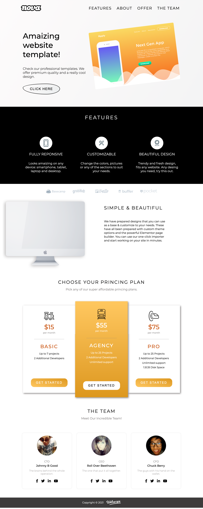

# Project HTML & CSS - basic

My first project from scratch - landing page. I used HTML and CSS. 
The landing page is based on Webscope project. This Landing page is not mobile-friendly.

## Technologies:

* HTML5
* CSS3
* BEM
* FLEXBOX

## Links

* Live Site URL: [E.Kopacz First Project](https://pensive-borg-6bc9e9.netlify.app)

## Solutions
Creating this project I had a opportunity to practice my HTML and CSS skills and learned few CSS properties like:

* transform-origin:

```
.hero__image__img {
    padding: 1rem 1rem;
    transform-origin: 0 100%;
    transform: rotate(-7deg);
}
```

* animations:

```
@keyframes center-column{
 0% {
    transform: scale(1);
    }

    100% {
    transform: scale(1.03);
 }
 ```

### Feel free to contact me:

* [Linkedin](https://www.linkedin.com/in/ewelina-kopacz-929559100/)

### Project preview




