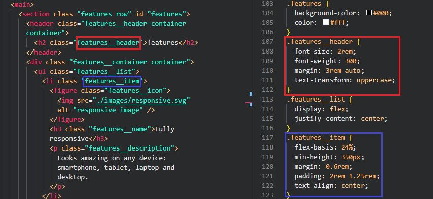

# HTML / CSS Website Project

See [the Website](https://wabinskim.github.io/task-html-and-css-basics/index.html)

Nova landing Page is a page modeled after [Webscope's](https://themewagon.com/author/webscopeapp/) free template: [Nova](https://themewagon.com/themes/project-app-showasing-onepage-bootstrap-template-free-nova/)

## Solutions provided in project

- using flexbox as a method of positioning elements
- using the [BEM](https://getbem.com/) methodology increases the readability of the code.
  
- values shared between different elements
  
- Properly implemented Montserrat font using @font-face

## I used HTML and CSS in this project

As it is my first project of landing page I didn't use RWD so it is only displays on desktop.

## Thanks

To my Mentor - devmentor.pl for providing me with this task and for code review.
